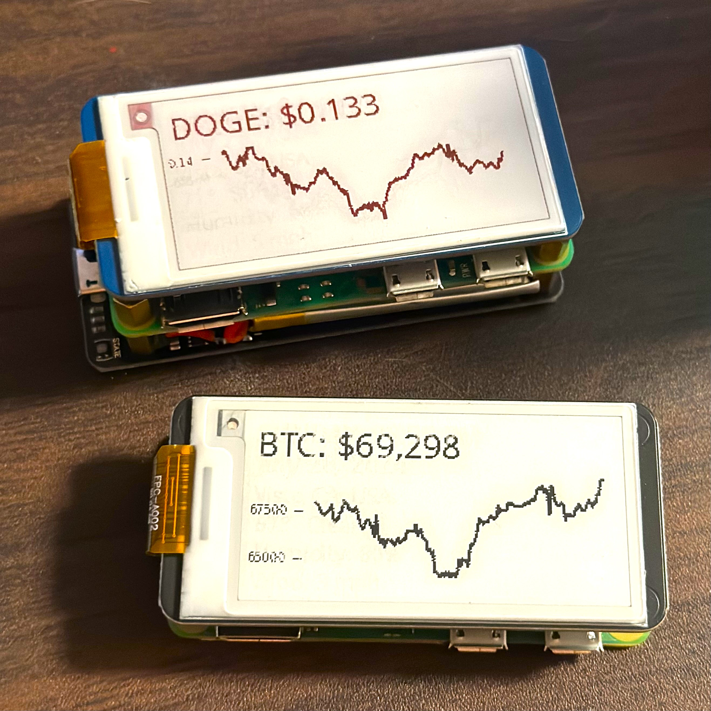
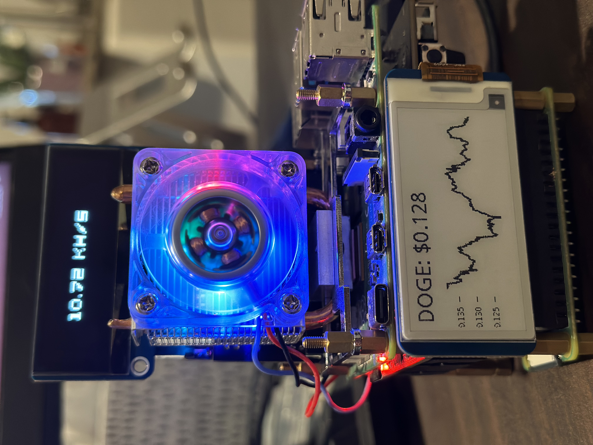

# 2.13in e-ink Price Ticker
<div style="display: flex; gap: 10px;">  
    
    
</div>

This project uses a 2.13inch e-ink display with a Raspberry Pi to display crypto prices.

# Materials
* [Raspberry pi Zero 2 WH](https://amzn.to/3VO7eu2)<br />
* [Micro SD Cards](https://amzn.to/4erXgWD)<br />
* [2.13inch e-ink](https://amzn.to/3WLFCX2)<br />
* [UPS Hat](https://amzn.to/4ceZp6I)<br />
<br />
(Amazon affiliate links)<br />

## **Installations**

1. **OS install:**
   - Install Raspberry Pi OS Lite (64-bit) on your Raspberry Pi <br />
   
2. **Enable SPI & I2C:**
   - Open a terminal on your Raspberry Pi.
   - Run `sudo raspi-config`
   - Navigate to Interfacing Options -> SPI -> Enable.
   - Navigate to Interfacing Options -> I2C -> Enable.

3. **Python libraries:**
   - sudo apt-get update
   - sudo apt-get install python3-pip -y
   - sudo apt-get install python3-pil -y
   - sudo apt install python3-spidev -y
   - sudo apt-get install python3-numpy -y
   - sudo apt install python3-matplotlib -y
   <br />

# Wiring and Setup
1. **Connect 2.13inch e-Ink HAT to Raspberry Pi:**
   - Connect the 2.13inch e-Ink HAT to your Raspberry Pi. <br />
   - Connect the UPS Hat for continuous power supply. This will allow you to move the project anywhere without worrying about power interruptions.

2. Clone the repository:
   ```bash
   sudo apt install git -y
   git clone https://github.com/frogCaller/e-ink-ticker.git
   cd e-ink-ticker
  
# Usage
Run the script:
   - `python3 display.py`

# How It Works
  - The script fetches cryptocurrency prices and 7-day historical data from the CoinGecko API every 5 minutes.
  - The data is displayed on the e-Ink screen, refreshing every 20 seconds.
  - The y-axis scale of the graphs is adjusted based on the lowest and highest prices of the week.

# Troubleshooting
Common Issues:
   - Ensure SPI & I2C are enabled in the Raspberry Pi configuration.
   - Check all connections if the screen does not display anything.
   - Verify all required packages are installed correctly.
   - [More Info](https://www.waveshare.com/wiki/2.13inch_e-Paper_HAT_Manual)
